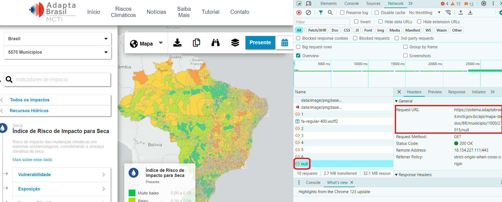

# Como acessar a API da plataforma AdaptaBrasil

Este repositório contem scripts para acessar os dados da plataforma AdaptaBrasil, automatizando a obtenção desses dados e possibilitando o acesso de maneira dinâmica.

O script Python [AdaptaBrasilAPIAccess.py](AdaptaBrasilAPIAccess.py) gera um CSV com todos os indicadores da plataforma. Alternativamente pode ser usado o CSV [adaptaBrasilAPIEstrutura.csv](adaptaBrasilAPIEstrutura.csv), que contém as URLs já geradas para cada indicador. Como a plataforma é constantemente atualizada, este CSV pode estar desatualizado, sendo preferível executar o script toda vez que for baixar novos dados. As instruções e parâmetros para se executar o script encontram-se abaixo.

As colunas do CSV gerado são separadas pelo caractere "|", em vez de vírgula ou ponto-e-vírgula. Quando abrir esse arquivo no Excel, indique o "|" como separador.

## Iniciando

Para acessar os dados do AdaptaBrasil são usadas URLs que especificam qual o dado a ser obtido, bem como alguma opção de filtro.

Uma das maneiras de se obter essas URLs é navegar pela plataforma com o browser em modo depuração, buscar a aba Rede (Network) do navegador e observar as URLs acessadas:



Estão indicadas em vermelho as referências à URL chamada para obter dados para o preenchimento dos valores dessa tela. Se for clicado em na referência à URL (null na tela), será aberta uma outra aba do browser com os dados exibidos na tela. Os dados são retornados por default em formato JSON. Quando é especificado um formato, como no caso das URLs de download de dados, será feito um arquivo .zip contendo os dados no formato solicitado.

Se a ideia for obter dados de muitos indicadores e/ou em diferentes formatos, a melhor opção é executar o script [AdaptaBrasilAPIAccess.py](AdaptaBrasilAPIAccess.py). Ele pode receber os seguintes parâmetros:

Parâmetros:
```commandline
python AdaptaBrasilAPIAccess.py --help

Parâmetros:
  --help                         Mostra essa mensagem e sai.
  --base_url BASE_URL            URL base de uma versão do AdaptaBrasil.
  --schema SCHEMA                Esquema a ser usado. Atualmente só esta disponível o esquema adaptabrasil.
  --recorte RECORTE              Recorte a ser usado nas URLs.
  --resolucao RESOLUCAO          Resolução a ser usada nas URLs.
  --arquivo_saida ARQUIVO_SAIDA  Nome do arquivo destino (CSV).
```

Ele gerará um arquivo atualizado com as seguintes colunas:

**id**: id do ìndicador.
		  
**nome**: nome do indicador.

**url_mostra_mapas_na_tela**: Exibe o portal no navegador de acordo com os parâmetros indicados.

Exemplo: https://sistema.adaptabrasil.mcti.gov.br/5000/1/2015/null/BR/municipio/adaptabrasil

Parâmetros (separados por / após gov.br na URL):

_Indicador_: id do indicador, conforme pode ser obtido na hierarquia (5000, no exemplo).

Dado a ser exibido: formato na tela em que os dados serão exibidos (1, no exemplo). 

    1: Mapa
    2: Totais
    3: Evolução
    4: Tendência

_Ano_: Ano dos dados exibidos (2015).

_Cenário_: id do cenário a ser exibido. Os ids dos cenários possíveis estão indicados na hierarquia. 

_Recorte_: recorte a que corresponderão os dados exibidos (BR significa todo o Brasil). Os recortes possíveis estão indicados na hierarquia.

_Resolução_: resolução a que corresponderão os dados exibidos (municipio). As resoluções possíveis estão indicadas na hierarquia.

_Esquema_: O conjunto de setores estratégicos a ser acessado (atualmente o único disponível é o adaptabrasil)

**url_obtem_dados_indicador**: Obtem os dados de um indicador associados a um recorte e uma resolução.

Exemplo: https://sistema.adaptabrasil.mcti.gov.br/api/mapa-dados/BR/municipio/1000/2015/null/adaptabrasil

_Nome da API_: (fixo, mapa-dados).

_Recorte_: recorte a que corresponderão os dados exibidos (BR). Os recortes possíveis estão indicados na hierarquia.

_Resolução_: resolução a que corresponderão os dados exibidos (municipio). As resoluções possíveis estão indicadas na hierarquia.

_Indicador_: id do indicador, conforme pode ser obtido na hierarquia (1000, no exemplo).

_Ano_: Ano a que deverão corresponder os dados exibidos (2015).

_Cenário_: id do cenário a ser exibido (null, no exemplo). Os ids dos cenários possíveis estão indicados na hierarquia. 

_Esquema_: (adaptabrasil)

**url_obtem_totais_evolucao_tendencia**: Obtém dados por faixa de valores de um determinado indicador monstrados nas telas de Totais, Evolução e Tendência do Adapta Brasil:

Exemplo: https://sistema.adaptabrasil.mcti.gov.br/api/total/BR/municipio/1000/null/2015/adaptabrasil: 

_Nome da API_: (fixo, _total_).

_Recorte_: recorte a que corresponderão os dados exibidos (BR - Brasil). Os recortes possíveis estão indicados na hierarquia.

_Resolução_: resolução a que corresponderão os dados exibidos (municipio). As resoluções possíveis estão indicadas na hierarquia.

_Indicador_: id do indicador, conforme pode ser obtido na hierarquia (1000, no exemplo).

_Cenário_: id do cenário a ser exibido (null, no exemplo). Os ids dos cenários possíveis estão indicados na hierarquia. 

_Ano_: Ano a que deverão corresponder os dados exibidos (2015).

_Esquema_: (adaptabrasil)

**url_faz_download_geometrias_dados**: faz o download de geometrias com seus dados associados, em diversos formatos.

Exemplo: https://sistema.adaptabrasil.mcti.gov.br/api/geometria/data/1000/BR/null/2015/municipio/SHPz/adaptabrasil

_Nome da API_: (fixo, _geometria/data_).

_Indicador_: id do indicador, conforme pode ser obtido na hierarquia (1000, no exemplo).

_Recorte_: recorte a que corresponderão os dados exibidos (BR - Brasil). Os recortes possíveis estão indicados na hierarquia.

_Cenário_: id do cenário a ser exibido (null, no exemplo). Os ids dos cenários possíveis estão indicados na hierarquia. 

_Ano_: Ano a que deverão corresponder os dados exibidos (2015).

_Resolução_: resolução a que corresponderão os dados exibidos (municipio). As resoluções possíveis estão indicadas na hierarquia.

Formatos geoespaciais disponíveis:

    SHPz    : shapefile (arquivo zip contendo os vários arquivos que compõe o formato).
    GEOJSONz: geoJSON
    KMZz    : formato compatível com o Google Maps

Formatos tabulares disponíveis:

    JSONz: JSON
    XLSXz: planilha Excel
    CSV  :   CSV (texto com colunas separadas por ';')

Formato de imagem disponível:

    PNG: png

_Esquema_: (adaptabrasil)

**descricao_simples**: descrição simplificada do que os dados desse indicador representam.

**descricao_completa**: descrição detalhada do indicador.

**nivel**: nível do indicador na hierarquia que os agrupa. Só os indicadores de nívem maior que 1 possuem dados associados a eles.

**proporcao_direta**: indica se quanto maior o valor pior ou melhor o significado dele.

Valores:

    0: indica que valores maiores significam uma situação pior.
    1: indica que valores maiores significam uma situação melhor.

**indicador_pai**: os indicadores formam uma hierarquia. Os indicadores de nivel "1", que correspondem aos Setores Estratégicos, agrupam alguns dos de nível "2" e assim por diante, e essa coluna expressa essa relação.

**anos**: anos para os quais há valores desse indicador.

**setor_estrategico**: setor estratégico ao qual pertence o indicador.

**tipo_geometria**: tipo das geometrias usadas nesse indicador: Multipolygon, MultilineString, MultiPoint.

**unidade_medida**: unidade de medida dos valores do indicador.

**cenários**: cenários possíveis para esse indicador.

**url_obtem_dados_fatores_influenciadores**: Os valores dos indicadores com nível menor que 6 são compostos por indicadores de níveis abaixo.
Esse serviço retorna a composição dos valores dos indicadores com base nos níveis seguintes

Parâmetros:

**clipping**: recorte do mapa. Alternativas de exemplo: "BR", "semiárido", "SE", "PE", "MG", "CE", "BA", "PI", "AL", "PB", "RN", "MA"

**resolution**: resolução do mapa. Alternativas: "microrregiao", "mesorregiao", "municipio", "estado", "regiao"

**indicator_id**: id do indicador a ser exibido

**scenario_id**: 1 (Otimista), 2 (Pessimista) ou null quando o indicador não tiver essa cenários.

**resolution_id**: id do objeto a ser exibido, conforme a resolução (county_id para a resolução município, microregion_id para a resolução microrregiao, macroregion_id para a resolução macrorregiao e state para a resolução estado).

**esquema**: adaptabrasil

Exemplo URL: https://sistema.adaptabrasil.mcti.gov.br/api/info/BR/municipio/2/5503/2020/null/adaptabrasil: 

Exemplo saída:
```json
{
  "id": "5463",
  "name": "Apuí/AM",
  "value": "0,17",
  "nextlevel": [
    {
      "id": 5001,
      "pessimist": 1,
      "title": "Índice de Vulnerabilidade",
      "simple_description": "Grau de suscetibilidade de um sistema socioecológico aos efeitos das mudanças climáticas, especificamente aquelas que resultam em seca",
      "complete_description": "Grau de suscetibilidade a danos, com potencial para mudança ou transformação do sistema socioecológico, quando confrontado com uma ameaça. A vulnerabilidade está associada às situações de sensibilidade e capacidade adaptativa do sistema socioecológico às alterações climáticas (seca). Assim, o Índice de Vulnerabilidade é resultante da composição dos índices de Sensibilidade e Capacidade Adaptativa.\u003Cbr\u003E\u003Cbr\u003EFontes:\u003Cbr\u003EGALLOPÍN, G. C.. Linkages between vulnerability, resilience, and adaptive capacity. Global Environmental Change, v. 16, p. 293-303, 2006.\u003Cbr\u003EINTERGOVERNMENTAL PANEL ON CLIMATE CHANGE - IPCC. Climate Change 2014: Synthesis Report. Working Groups I, II and III to the Fifth Assessment Report of the Intergovernmental Panel on Climate Change [Core Writing Team, R.K. Pachauri and L.A. Meyer (eds.)]. IPCC, Geneva, Switzerland, 151 pp.",
      "year": 2015,
      "value": "0,60",
      "valuecolor": "#FF8300",
      "rangelabel": "Alto"
    },
    ...
],
  "lastlevel": [
    {
      "id": 5032,
      "pessimist": 0,
      "title": "Acesso ao Programa Garantia Safra",
      "simple_description": "Nível de acesso ao Programa Garantia Safra por produtores rurais",
      "complete_description": "O Programa Garantia Safra é um seguro destinado a agricultores de baixa renda (até um salário mínimo e meio) cadastrados no programa, que passam a receber o benefício quando o município em que moram comprova a perda de, pelo menos, 50% do conjunto das produções de feijão, milho, arroz, mandioca e algodão em razão de estiagem ou excesso hídrico. Indicador de capacidade adaptativa relacionado a manutenção da produção agropecuária, obtido pela multiplicação entre o inverso da magnitude de perda de produtividade dos produtos básicos (feijão, mandioca, milho e arroz), em módulo, entre os períodos 2006 a 2016 e 2014 a 2016, e a razão entre os agricultores beneficiados entre 2014 e 2016 e o número de estabelecimentos agropecuários com agricultura familiar em 2016, estimado a partir de dados populacionais rurais para o mesmo ano. Foi realizada uma padronização, onde se considerou três situações: 1) os municípios sem informação ou que não tiveram perda de produtividade agrícola no período analisado, receberam valores NA (Not Available); 2) os municípios que tiveram perdas e não foram beneficiados pelo seguro, receberam valor “zero”; e 3) os municípios que apresentaram perdas e foram contemplados pelo seguro safra, foram normalizados a partir do valor mínimo atribuído (0,30). Posteriormente, o valor normalizado resultante foi multiplicado pelo peso atribuído pelos especialistas considerando a relevância regional do mesmo à ameaça de seca. Os dados foram obtidos da Produção Agrícola Municipal (PAM), disponibilizado pelo Instituto Brasileiro de Geografia e Estatística (IBGE).\u003Cbr\u003E\u003Cbr\u003EFonte:\u003Cbr\u003ESistema de Informações e Análises sobre Impactos das Mudanças Climáticas - AdaptaBrasil MCTI.",
      "year": 2010,
      "value": "7,0"
    },
    ...
  ],
  "valuecolor": "#02C650",
  "rangelabel": "Muito baixo"
}
```

### API de hierarquia

A API de hierarquia acessa todos os indicadores que compõe o site (sem os dados). Um exemplo do retornado por essa API pode ser visto [aqui](https://sistema.adaptabrasil.mcti.gov.br/api/hierarquia/adaptabrasil).

O parâmetro **adaptabrasil** especifica o esquema de dados a ser acessado. Atualmente há apenas um esquema disponível, chamado **adaptabrasil**.
