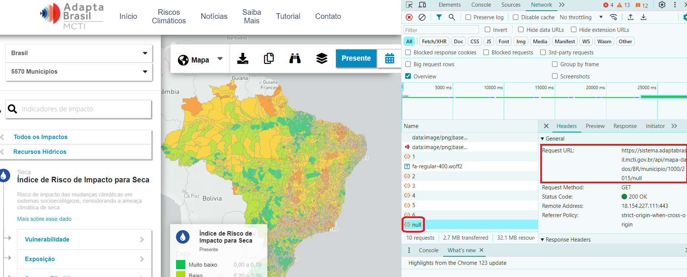

# Como acessar a API da plataforma Adapta Brasil

O que está aqui disponibilizado são recursos para se acessar os dados da plataforma usando-se scripts, automatizando a obtenção desses dados e possibilitando até que outros sites façam esse acesso de maneira dinâmica.

Há um script Python, [AdaptaBrasilAPIAccess.py](AdaptaBrasilAPIAccess.py), que gera URLs exemplo de cada API existente, ou pode ser usado o CSV [adaptaBrasilAPIEstrutura.csv](adaptaBrasilAPIEstrutura.csv) como exemplo.

As colunas do CSV gerado são separadas pelo caractere "|", em vez de vírgula ou ponto-e-vírgula como é usual. Isso porque esses caracteres aparecem nos textos da então optou-se pelo "|", que normalmente não é usado em textos.

Quando abrir esse arquivo no Excel, indique o "|" como separador.

## Iniciando

Para acessar os dados do Adapta usam-se URLs que especificam qual o tipo de dado a ser obtidos e algum tipo de filtro.

Uma das maneiras de se obter essas URLs é navegar pela plataforma com o browser em modo depuração, buscar a aba Rede (Network) e observar as URLs acessadas:

Estão indicados em vermelho as referências à URL chamada para obter dados para o preenchimento dos valores dessa tela.

Se for clicado em na referência à URL (null na tela), será aberta uma outra aba do browser com os dados exibidos na tela.

Os dados são retornados por default em formato JSON. Quando é especificado um formato, como no caso das URLs de download de dados, será feito um arquivo .zip contendo os dados no formato solicitado.

Outra opção é executar o script **adaptaBrasilAPIEstrutura.py**. Ele pode receber os seguintes parâmetros:

https://sistema.adaptabrasil.mcti.gov.br/api/hierarquia/adaptabrasil

Acessa a hierarquia de indicadores que compõe o site. Um exemplo do retornado por essa API pode ser visto [aqui](jsonsamples%2Fhierarchy.json).

O parâmetro **adaptabrasil** especifica o conjunto de dados a ser acessado. Atualmente há dois conjuntos de dados: **Adapta Brasil** e **Riscos Climáticos**, que são selecionados por esse último parâmetro, respectivamente **adaptabrasil** e **riscos_climaticos**.

## Colunas do CSV

### id:
id do ìndicador.

### nome: 
Nome do indicador.

**url_mostra_mapas_na_tela**: Exibe o portal no browser de acordo com os parâmetros indicados.

Exemplo: https://sistema.adaptabrasil.mcti.gov.br/5000/1/2015/null/BR/municipio/adaptabrasil: 

Parâmetros:

_Indicador_: id do indicador, conforme pode ser obtido na hierarquia (5000, no exemplo).

Dado a ser exibido: formato na tela em que os dados serão exibidos (1, no exemplo). 

    1: Mapa
    2: Totais
    3: Evolução
    4: Tendência

_Ano_: Ano a que deverão corresponder os dados exibidos (2015).

_Cenário_: id do cenário a ser exibido. Os ids dos cenários possíveis estão indicados na hierarquia. 

_Recorte_: recorte a que corresponderão os dados exibidos (BR - Brasil). Os recortes possíveis estão indicados na hierarquia.

_Resolução_: resolução a que corresponderão os dados exibidos (municipio). As resoluções possíveis estão indicadas na hierarquia.

_Conjunto de dados_: (adaptabrasil)

**url_obtem_dados_indicador**: Obtem os dados de um indicador associados a um recorte e uma resolução.

Exemplo: https://sistema.adaptabrasil.mcti.gov.br/api/mapa-dados/BR/municipio/1000/2015/null/adaptabrasil

_Nome da API_: (fixo, mapa-dados).

_Recorte_: recorte a que corresponderão os dados exibidos (BR - Brasil). Os recortes possíveis estão indicados na hierarquia.

_Resolução_: resolução a que corresponderão os dados exibidos (municipio). As resoluções possíveis estão indicadas na hierarquia.

_Indicador_: id do indicador, conforme pode ser obtido na hierarquia (1000, no exemplo).

_Ano_: Ano a que deverão corresponder os dados exibidos (2015).

_Cenário_: id do cenário a ser exibido (null, no exemplo). Os ids dos cenários possíveis estão indicados na hierarquia. 

_Conjunto de dados_: (adaptabrasil)

**url_obtem_totais_evolucao_tendencia**: Obtém dados por faixa de valores de um determinado indicador monstrados nas telas de Totais, Evolução e Tendência do Adapta Brasil:

Exemplo: https://sistema.adaptabrasil.mcti.gov.br/api/total/BR/municipio/1000/null/2015/adaptabrasil: 

_Nome da API_: (fixo, _total_).

_Recorte_: recorte a que corresponderão os dados exibidos (BR - Brasil). Os recortes possíveis estão indicados na hierarquia.

_Resolução_: resolução a que corresponderão os dados exibidos (municipio). As resoluções possíveis estão indicadas na hierarquia.

_Indicador_: id do indicador, conforme pode ser obtido na hierarquia (1000, no exemplo).

_Cenário_: id do cenário a ser exibido (null, no exemplo). Os ids dos cenários possíveis estão indicados na hierarquia. 

_Ano_: Ano a que deverão corresponder os dados exibidos (2015).

_Conjunto de dados_: (adaptabrasil)

**url_faz_download_geometrias_dados**: faz o download de geometrias com seus dados associados, em diversos formatos:
https://sistema.adaptabrasil.dev.apps.rnp.br/api/geometria/data/1000/BR/null/2015/municipio/SHPz/adaptabrasil

_Nome da API_: (fixo, _geometria/data_).

_Indicador_: id do indicador, conforme pode ser obtido na hierarquia (1000, no exemplo).

_Recorte_: recorte a que corresponderão os dados exibidos (BR - Brasil). Os recortes possíveis estão indicados na hierarquia.

_Cenário_: id do cenário a ser exibido (null, no exemplo). Os ids dos cenários possíveis estão indicados na hierarquia. 

_Ano_: Ano a que deverão corresponder os dados exibidos (2015).

_Resolução_: resolução a que corresponderão os dados exibidos (municipio). As resoluções possíveis estão indicadas na hierarquia.

Formatos geoespaciais disponíveis:

    SHPz    : shapefile (arquivo zip contendo os vários arquivos que compõe o formato).
    GEOJSONz: geoJSON
    KMZz    : formato compatível com o Google Maps

Formatos tabulares disponíveis:

    JSONz: JSON
    XLSXz: planilha Excel
    CSV  :   CSV (texto com colunas separadas por ';')

Formato de imagem disponível:

    PNG: png

_Conjunto de dados_: (adaptabrasil)

**descricao_simples**: descrição simplificada do que os dados desse indicador representam.

**descricao_completa**: descrição detalhada do indicador.

**nivel**: nível do indicador na hierarquia que os agrupa. Só os indicadores de nívem maior que 1 possuem dados associados a eles.

**proporcao_direta**: indica se quanto maior o valor pior ou melhor o significado dele.

Valores:

    0: indica que valores maiores significam uma situação pior.
    1: indica que valores maiores significam uma situação melhor.

**indicador_pai**: os indicadores formam uma hierarquia. Os indicadores de nivel "1", que correspondem aos Setores Estratégicos, agrupam alguns dos de nível "2" e assim por diante, e essa coluna expressa essa relação.

**anos**: anos para os quais há valores desse indicador.

**setor_estrategico**: setor estratégico ao qual pertence o indicador.

**tipo_geometria**: tipo das geometrias usadas nesse indicador: Multipolygon, MultilineString, MultiPoint.

**unidade_medida**: unidade de medida dos valores do indicador.

**cenários**: cenários possíveis para esse indicador.